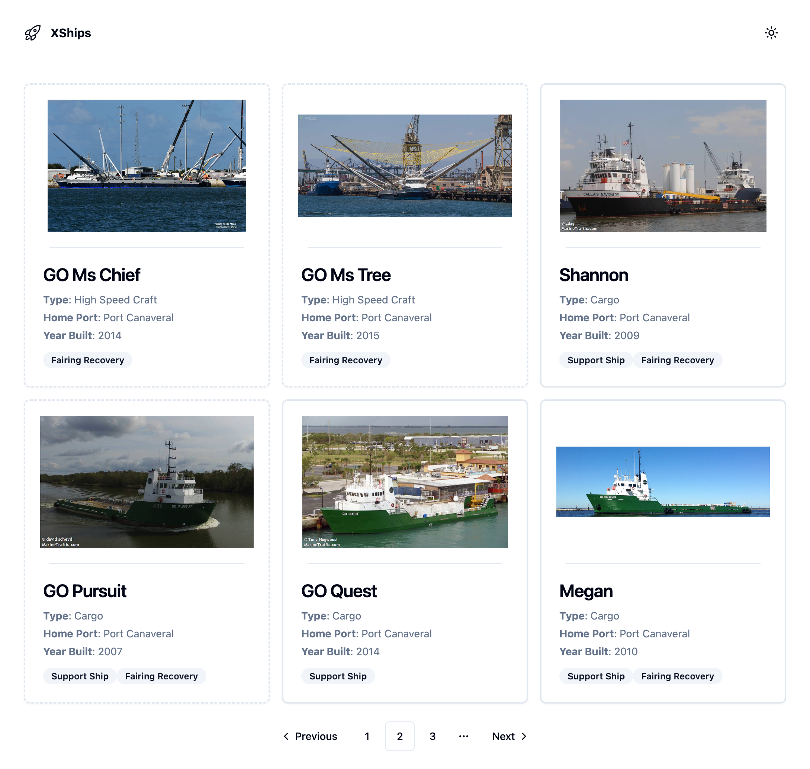
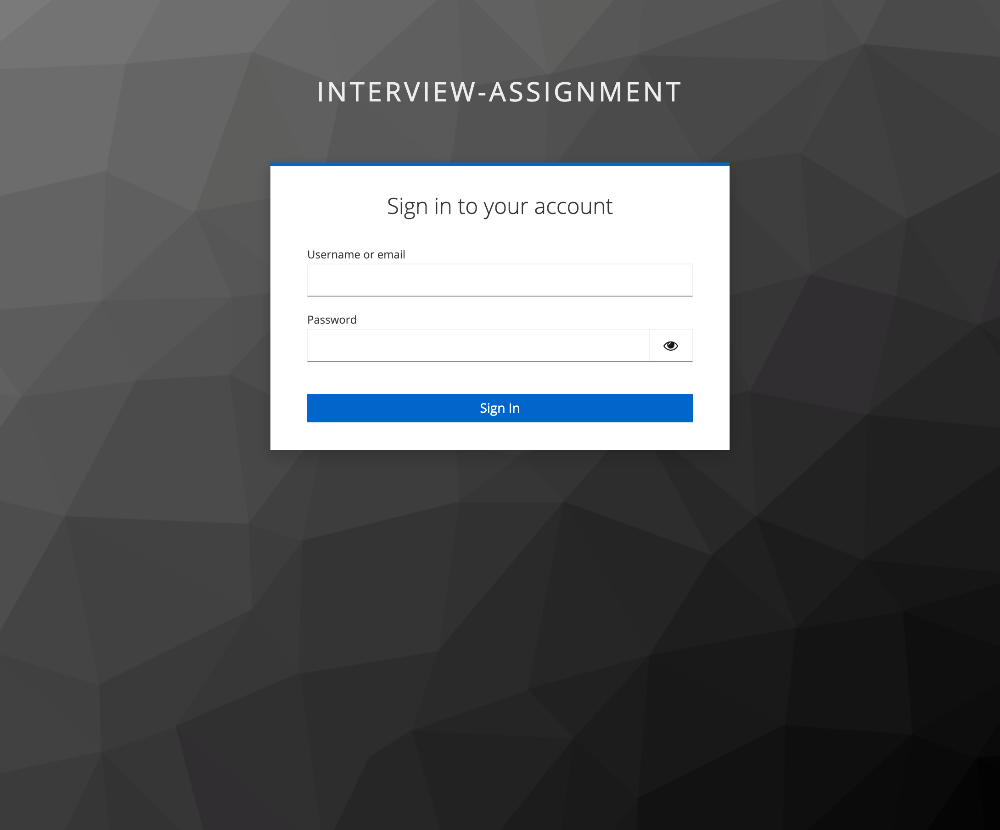
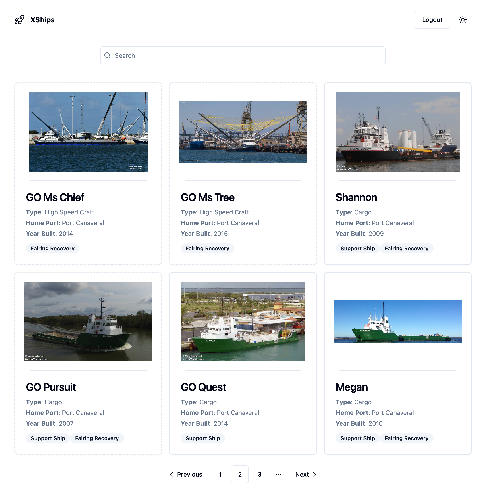

# interview-assignment

### FE React code assignment

### Junior assignment

- You're building simple web application for displaying Ships
  from [SpaceX API](https://github.com/r-spacex/SpaceX-API/tree/master/docs/ships/v4)
- Ships app should have:
    - header with link to home page (/) and theme switch icon for switching between light and dark theme
    - main content with ship cards containing image and basic information about ship (name, type, home_port, year_built, roles),
      additionally if ships is not "active" border of the card should be dashed. There should be maximum three cards in one row.
    - page navigation which should be on the bottom of the page and should have the following behaviour:
      - previous and next buttons
      - previous button is not visible when the first page is active
      - next button is not visible when the last page is active
      - page number should be persisted in the URL (on page refresh last active page should still be active)
      - if there is only one page next and previous buttons should not be visible
 
Ships UI design 


Implementation details and requirements:

- clone the project: <git submodule url>
- project already has some basic setup (prettier, eslint, jest, tsconfig, tailwind config, shadcn)
- use [shadcn](https://ui.shadcn.com/) UI components when developing Ships app
- use Typescript

### Medior

Assignment:

- You're building simple web application for displaying Ships
  from [SpaceX API](https://github.com/r-spacex/SpaceX-API/tree/master/docs/ships/v4)
- Ships app should have:
    - page with login button:
        - login button should call keycloak server to show default keycloak login screen
        - keycloak configuration is provided in `keycloak-config.json` file
    - header with link to home page (/) on the left side, on the right side logout button and theme switch icon for switching between light and dark theme
    - logout button should call keycloak server to remove user session and logout the user
    - search input filed for searching ships by name:
        - search term should be persisted in the URL (on page refresh user should still see same search result)
    - main content with ship cards containing image and basic information about ship (name, type, home_port, year_built, roles),
      additionally if ships is not "active" border of the card should be dashed. There should be maximum three cards in one row.
    - page navigation which should be on the bottom of the page and should have the following behaviour:
        - previous and next buttons
        - previous button is not visible when the first page is active
        - next button is not visible when the last page is active
        - page number should be persisted in the URL (on page refresh last active page should still be active)
        - if there is only one page next and previous buttons should not be visible

Keycloak login credentials
```
{
  "username": "test-user",
  "password": "pass"
}
```

Ships UI design





Implementation details and requirements:

- clone the project: https://github.com/GoodbyePlanet/interview-assignment
- project already has some basic setup (prettier, eslint, jest, tsconfig, tailwind config, shadcn)
- use keycloak to authenticate user
- use [shadcn](https://ui.shadcn.com/) UI components when developing Ships app
- use Typescript
